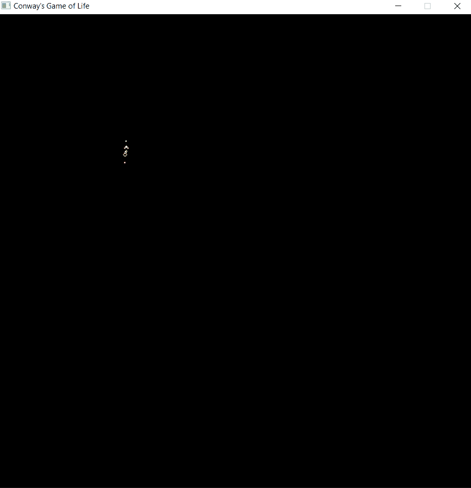
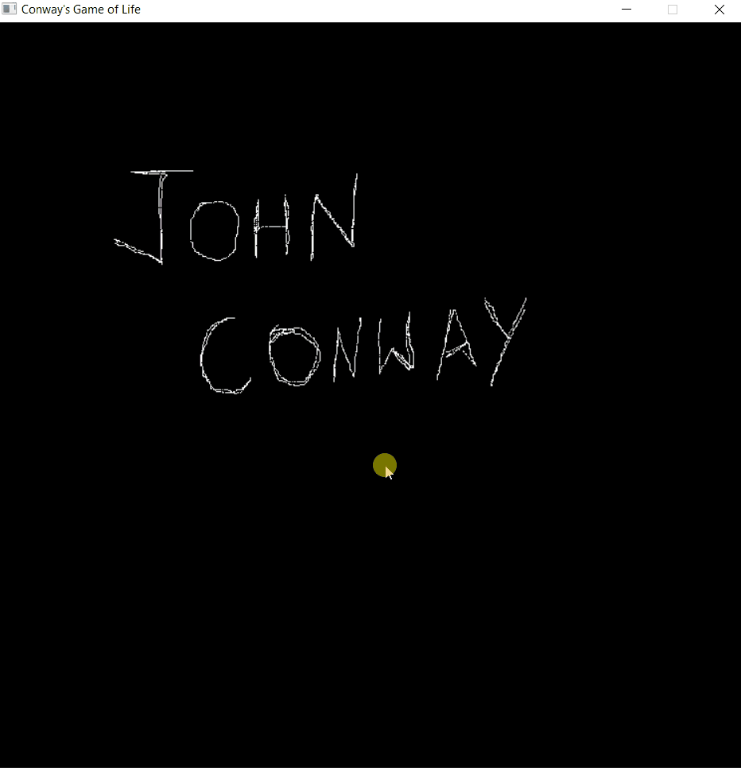

# Game of Life

[Download](https://github.com/dipesh-m/Game-of-Life/releases)

John Conway's Game of Life implemented in C++ with SDL2 Library.

The Game of Life is a cellular automaton devised by the British mathematician John Horton Conway in 1970. It is a zero-player game, meaning that its evolution is determined by its initial state, requiring no further input. [Read more about Conway's Game of Life on Wikipedia](https://en.wikipedia.org/wiki/Conway%27s_Game_of_Life).

# How to run:-

Option 1.) You can run Game of Life directly from the release. Download the release and run the .exe application i.e., Conway's Game of Life.exe -> [Download](https://github.com/dipesh-m/Game-of-Life/releases)

Option 2.) You can also run Conway's Game of Life using the C++ source code available in the repository i.e., life.cpp but you will need to install and setup the SDL2 library first. I recommend you follow Lazy Foo' Productions' tutorial to setup SDL2 Library. PLEASE NOTE THAT the tutorial follows to setup SDL2 32-bit library but to run Game of Life you have to use the 64-bit library. Just use x86_64-w64-mingw32 folder instead of i686-w64-mingw32 to setup the SDL2 files.-> [How to download and setup SDL2 library](http://lazyfoo.net/tutorials/SDL/01_hello_SDL/index.php).
After setting up the SDL2 library, just include the life.cpp file from the repository in your project with the build options as mentioned in the tutorial and build and run the project.

# Controls:-

- In a running simulation, you can use LEFT MOUSE BUTTON to draw cells. As soon as you release the left mouse button, those drawn cells will become live.

- If you choose the option to draw cells in an empty map(i.e. Option 9), you'll have to use RIGHT MOUSE BUTTON to draw the pixelated cells that will initialize the map. Then, press ENTER to start the simulation with those drawn cells.

- Press q or close the simulation window to exit out of the simulation...but if you chose to draw on an empty map(i.e., Option 9), you'll have to press q twice OR close the simulation window twice to quit.

- Press SPACE to pause the running simulation at any time and press SPACE again to continue.

# Samples

- Sample 1

- Sample 2

- Sample 3

- Sample 4

